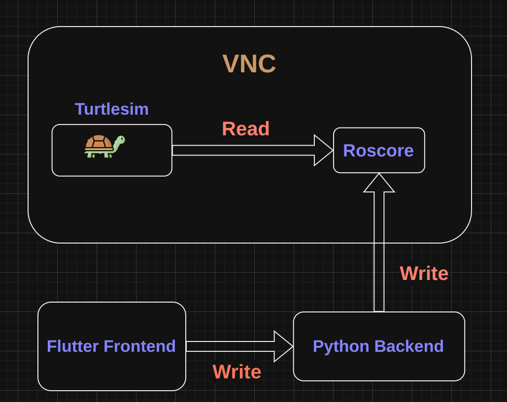

# ROS-based Mars Rover / Turtle Simulation Control Web App

This project is a Flutter web application that allows users to view a livestream and control either a Mars rover or a turtle simulation using a virtual joystick. The application is built on a ROS (Robot Operating System) backend and uses Docker for easy deployment and management.

## Description

In this Flutter web app, you can:
- View a live video stream from either a Mars rover or a turtle simulation
- Control the rover or turtle using an on-screen joystick interface
- Switch between controlling a Mars rover or a turtle simulation

The application consists of three main services:
1. A **VNC-enabled ROS** environment running the **Turtlesimulation**
2. A **Python backend server**, which is the ***middleware*** between **vnc** and the **frontend**
3. A **Flutter web application** frontend for user interaction

## Requirements

- Docker
- Docker Compose

## Installation and Usage

1. Clone this repository:
   ```
   git clone <repository-url>
   cd <repository-directory>
   ```

2. Make sure you have Docker and Docker Compose installed on your system.

3. To start the application:
   ```
   docker-compose up --build
   ```
   This command will build the Docker images (if needed) and start all the services defined in the `docker-compose.yaml` file.

4. To stop and restart the application:
   ```
   docker-compose stop && docker-compose up --build
   ```
   This will stop all running containers, rebuild the images, and start the services again.

## Accessing the Application

- **Frontend**: Access the Flutter web application at `http://localhost:8080`. Here you can view the livestream and control the rover or turtle simulation.
- **Simulation**: After everything is started, access the simulation interface at `http://localhost:6080/vnc.html` and login with the password 1234.

**Note:** Ensure all services are fully started before attempting to access the frontend or simulation interfaces.

## Demo Livestream

## Demo Turtlesim


## Communication Diagram


## Notes

- The ROS master is running on port 11311 inside the `vnc_ros` container.
- WebSocket communication is available on port 8765.

For more detailed information about each service, refer to the `docker-compose.yaml` file and the individual service directories.